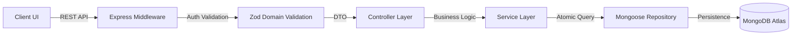

# 🛠️ InventoryPro Technical Documentation: Core Architecture & Design

This document is intended for engineers and architects. It details the system design, tech stack justifications, and maintenance protocols of the InventoryPro ecosystem.

---

## 🏗️ System Architecture & Data Flow

InventoryPro utilizes a **Controller-Service-Repository (CSR)** pattern within a decoupled Monorepo structure. This ensures high testability and strict separation of concerns.

### 🔄 Logical Transaction Flow



### 📁 Structural Overview
- **`client/`**: React 19 SPA. Uses **Vite** for HMR. Focused on atomic components and custom hooks for state management.
- **`server/`**: Express.js in **strict-mode TypeScript**. Logic is extracted from routes into dedicated services to allow for future migration to microservices.
- **`shared/`**: (Logical) Type sharing between frontend and backend via common interfaces to ensure contract-first development.

---

## ⚡ Technical Stack Rationale

### **Why React 19 + Vite?**
- **React Server Components ready**: Future-proofing the architecture.
- **Vite**: 10x faster HMR than Webpack, essential for a large B2B SaaS dashboard.

### **Why TypeScript?**
Inventory management involves financial transactions and stock movements. **Zero-runtime errors** are non-negotiable. TypeScript provides the "guards" necessary for complex product object manipulation.

### **Why MongoDB + Mongoose?**
- **Polymorphic Data**: Product schemas vary across different industries (e.g., electronics vs. textiles). NoSQL flexibility allows for rapid feature expansion without complex migrations.
- **Mongoose Aggregations**: Critical for real-time dashboard reports (summarizing thousands of movements in milliseconds).

---

## 🔑 Crucial Domain Logic: The "Movement" Atomicity
Unlike simple CRUD apps, InventoryPro treats stock changes as **Movements**, not just "update product quantity".
- **Rule**: Every change in stock must have a `Movement` record.
- **Audit Trail**: This creates a permanent, immutable record of who, when, and why a stock level changed.
- **Consistency**: Uses database transactions (where supported) or service-level logic to ensure `Product.stock` always matches the sum of `Movements`.

---

## 📡 API Reference (Core Endpoints)

| Endpoint | Method | Functionality | Auth Required |
| :--- | :--- | :--- | :--- |
| `/api/auth/login` | `POST` | Generates JWT Bearer Token | No |
| `/api/products` | `GET/POST`| Inventory management & catalog | Yes |
| `/api/movements`| `POST` | Atomic stock entry/exit/transfer | Yes |
| `/api/warehouses`| `GET` | Multi-location management | Yes |
| `/api/reports/valuation` | `GET` | Aggregated asset value reports | Yes (Admin) |

---

## ⚙️ Development & Maintenance Guide

### 1. Requirements
- **Node.js**: v22.x (LTS)
- **Database**: MongoDB v7.0+
- **Environment**: Setup `.env` based on `.env.template`

### 2. Rapid Setup
```bash
# Install dependencies for the entire ecosystem
npm run install-all

# Execute Database Seeding (Sample Warehouses, Products, Users)
npm run seed --prefix server

# Start Development Hot-Reload
npm run dev
```

### 3. Environment Variables
Create a `.env` file in the `server` directory using `.env.template` as a reference:
```env
# Core Configuration
PORT=4000
MONGODB_URI=your_mongodb_connection_string
JWT_SECRET=your_super_secret_jwt_key
NODE_ENV=development

# Frontend-Backend Integration
FRONTEND_URL=http://localhost:5173
APP_URL=http://localhost:4000
```

---

## 🛡️ Resilience & Security Measures
- **Security Headers**: `Helmet.js` implementation for XSS and Clickjacking protection.
- **Input Sanitization**: Total reliance on `Zod` to prevent NoSQL injection and malformed payloads.
- **Error Handling**: Centralized Express Error Middleware to ensure no sensitive stack traces are leaked to the client.

---

## 🚀 Scalability & Future Optimizations
1. **Caching Layer**: Integration of Redis for high-frequency product catalog reads.
2. **Event-Driven**: Transitioning Movement logic to an EventEmitter or Message Queue (RabbitMQ) for asynchronous processing of reports.
3. **Containerization**: Full Docker support for horizontal scaling across Kubernetes clusters.

---

## 🛠️ Testing Strategy
- **Unit Testing**: Vitest for Service-layer logic.
- **E2E Testing**: Playwright for critical "Golden Paths" (Login -> Add Product -> Stock Movement).
- **Static Analysis**: ESLint + Prettier with strict B2B rules.

---
*Maintained by the InventoryPro Architecture Team.*
